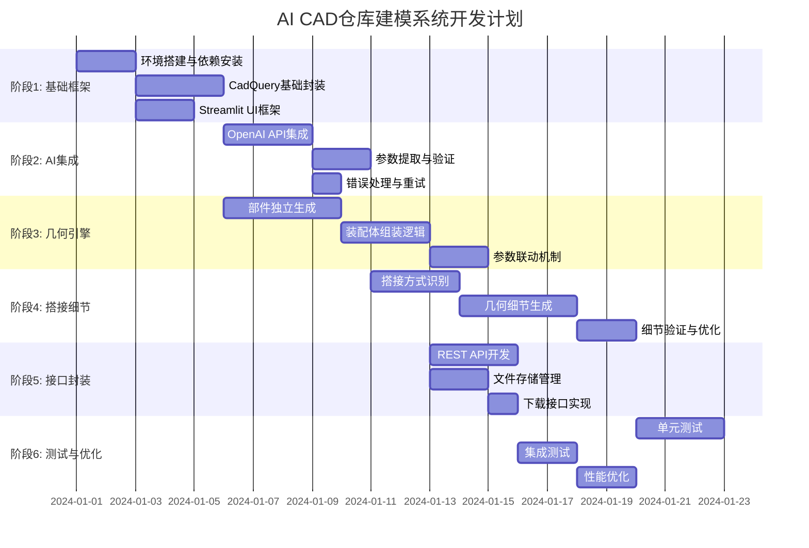

# 实现路径与开发指南

## 1. 开发阶段规划

### 1.1 阶段划分 (WBS)



### 1.2 里程碑

| 里程碑 | 交付物 | 验收标准 | 预计时间 |
|--------|--------|----------|----------|
| M1: 基础框架完成 | 可运行的Streamlit应用 | UI可访问，无功能错误 | Week 1 |
| M2: AI集成完成 | 图片→JSON参数提取 | 准确率≥80% | Week 2 |
| M3: 几何生成完成 | 基础仓库模型生成 | 可导出STEP文件 | Week 3 |
| M4: 部件独立化 | 部件文件独立存储 | 每个部件独立STEP文件 | Week 4 |
| M5: 搭接细节实现 | 搭接细节正确生成 | 与图片一致度≥85% | Week 5 |
| M6: API接口完成 | RESTful API可用 | 通过Postman测试 | Week 6 |
| M7: 测试完成 | 测试报告 | 覆盖率≥70% | Week 7 |

## 2. 详细实现步骤

### 2.1 阶段1: 基础框架搭建

#### 任务1.1: 环境搭建

**目标**: 配置Python开发环境，安装所有依赖

**步骤**:
1. 创建虚拟环境
   ```bash
   python -m venv venv
   source venv/bin/activate  # Windows: venv\Scripts\activate
   ```

2. 安装核心依赖
   ```bash
   pip install cadquery>=2.4.0
   pip install streamlit>=1.28.0
   pip install openai>=1.0.0
   pip install pillow>=10.0.0
   pip install python-dotenv>=1.0.0
   ```

3. 验证安装
   ```python
   import cadquery as cq
   import streamlit as st
   from openai import OpenAI
   print("✅ All dependencies installed")
   ```

**验收**: 所有import无错误，CadQuery可生成简单几何体

---

#### 任务1.2: 项目结构搭建

**目标**: 创建标准化的项目目录结构

**目录结构**:
```
aicad/
├── app.py                    # Streamlit主应用
├── warehouse_builder.py      # 几何引擎核心
├── ai_analyzer.py           # AI分析模块（新建）
├── parameter_validator.py   # 参数验证模块（新建）
├── component_factory.py     # 部件工厂（新建）
├── assembly_manager.py      # 装配管理器（新建）
├── utils/
│   ├── image_processor.py   # 图像处理工具
│   ├── file_manager.py      # 文件管理工具
│   └── logger.py            # 日志工具
├── tests/
│   ├── test_warehouse_builder.py
│   ├── test_ai_analyzer.py
│   └── test_parameter_validator.py
├── docs/                    # 文档目录
├── output/                  # 输出目录
└── requirements.txt
```

**验收**: 目录结构创建完成，所有空文件可正常导入

---

#### 任务1.3: Streamlit基础UI

**目标**: 搭建基础的Web界面框架

**实现要点**:
- 使用`st.set_page_config`配置页面
- 创建侧边栏（API Key输入、设置）
- 创建主内容区（上传、预览、结果展示）
- 实现文件上传组件

**代码框架**:
```python
# app.py 基础结构
import streamlit as st

st.set_page_config(page_title="AI Warehouse Builder", layout="wide")

with st.sidebar:
    api_key = st.text_input("OpenAI API Key", type="password")
    
st.title("🏭 AI Industrial Warehouse Builder")

uploaded_file = st.file_uploader("Upload Warehouse Photo", type=["jpg", "png"])
if uploaded_file:
    st.image(uploaded_file, caption="Uploaded Image")
```

**验收**: UI可正常访问，文件上传功能正常

---

### 2.2 阶段2: AI集成

#### 任务2.1: OpenAI API集成

**目标**: 实现图片→JSON参数提取

**实现文件**: `ai_analyzer.py`

**核心函数**:
```python
class AIAnalyzer:
    def __init__(self, api_key: str):
        self.client = OpenAI(api_key=api_key)
        self.model = "gpt-4o"
    
    def analyze_image(self, image_base64: str, user_prompt: str) -> dict:
        """
        分析图片并提取参数
        """
        system_prompt = self._build_system_prompt()
        
        response = self.client.chat.completions.create(
            model=self.model,
            messages=[
                {"role": "system", "content": system_prompt},
                {"role": "user", "content": [
                    {"type": "text", "text": user_prompt},
                    {"type": "image_url", "image_url": {
                        "url": f"data:image/jpeg;base64,{image_base64}"
                    }}
                ]}
            ],
            response_format={"type": "json_object"},
            temperature=0.1,
            timeout=30
        )
        
        return json.loads(response.choices[0].message.content)
    
    def _build_system_prompt(self) -> str:
        """构建系统提示词，包含JSON Schema定义"""
        # 返回详细的Schema描述（见PRD.md）
        pass
```

**关键点**:
- 系统提示词必须包含完整的JSON Schema描述
- 使用`response_format={"type": "json_object"}`强制JSON输出
- 实现重试机制（最多3次）
- 超时处理（30s）

**验收**: 给定测试图片，能返回符合Schema的JSON

---

#### 任务2.2: 参数验证模块

**目标**: 验证AI输出，补全缺失参数

**实现文件**: `parameter_validator.py`

**核心逻辑**:
```python
class ParameterValidator:
    def __init__(self):
        self.schema = self._load_schema()  # 从JSON Schema文件加载
        self.defaults = self._load_defaults()
    
    def validate_and_complete(self, ai_output: dict) -> dict:
        """
        验证并补全参数
        """
        # 1. 结构验证
        if not self._has_required_fields(ai_output):
            raise ValidationError("Missing required fields")
        
        # 2. 数值范围验证
        validated = self._validate_ranges(ai_output)
        
        # 3. 逻辑一致性验证
        validated = self._validate_logic(validated)
        
        # 4. 补全缺失参数
        completed = self._fill_defaults(validated)
        
        return completed
    
    def _validate_ranges(self, config: dict) -> dict:
        """验证数值范围"""
        # bay_width: 1000-4000mm
        # levels: 2-10
        # 等等...
        pass
    
    def _validate_logic(self, config: dict) -> dict:
        """验证逻辑一致性"""
        # total_height > first_beam_height + levels * beam_spacing
        # 等等...
        pass
```

**验收**: 不完整/错误的AI输出能自动修正为有效配置

---

### 2.3 阶段3: 几何引擎

#### 任务3.1: 部件独立生成

**目标**: 每个部件生成独立的STEP文件

**实现文件**: `component_factory.py`

**核心类**:
```python
class ComponentFactory:
    def __init__(self, output_dir: str = "output/components"):
        self.output_dir = output_dir
        os.makedirs(output_dir, exist_ok=True)
        self.component_counter = {}
    
    def create_upright(self, height: float, section: str, 
                      color: str, material: str = "steel") -> Component:
        """
        生成立柱部件并保存
        """
        # 1. 解析section (如 "80x60")
        width, depth = self._parse_section(section)
        
        # 2. 生成几何
        geometry = self._create_upright_geometry(width, depth, height)
        
        # 3. 保存为独立文件
        component_id = self._get_next_id("upright")
        filename = f"{self.output_dir}/upright_{component_id}.step"
        geometry.save(filename, exportType="STEP")
        
        # 4. 返回Component对象（包含文件路径和几何引用）
        return Component(
            id=component_id,
            type="upright",
            file_path=filename,
            geometry=geometry,  # 内存引用，用于后续装配
            metadata={
                "height": height,
                "section": section,
                "color": color
            }
        )
    
    def create_beam(self, length: float, section: str, 
                   color: str, connection_type: str) -> Component:
        """生成横梁部件"""
        # 类似逻辑...
        pass
    
    def create_decking(self, width: float, depth: float, 
                      type: str, thickness: float) -> Component:
        """生成层板部件"""
        # 类似逻辑...
        pass
```

**关键点**:
- 每个部件必须保存为独立STEP文件
- 同时保留内存中的几何引用（用于装配）
- 使用唯一ID命名文件
- 记录部件元数据（尺寸、颜色等）

**验收**: 生成3个部件，每个都有独立的STEP文件

---

#### 任务3.2: 装配体组装

**目标**: 引用部件文件组装成完整仓库

**实现文件**: `assembly_manager.py`

**核心逻辑**:
```python
class AssemblyManager:
    def __init__(self):
        self.assembly = cq.Assembly()
        self.components = {}  # 存储已加载的部件
    
    def build_warehouse(self, config: dict, component_factory: ComponentFactory):
        """
        根据配置组装仓库
        """
        # 1. 生成所有需要的部件（独立文件）
        components = self._generate_components(config, component_factory)
        
        # 2. 计算位置矩阵
        positions = self._calculate_positions(config)
        
        # 3. 组装部件
        for row in range(config["warehouse_config"]["overall_layout"]["rows"]):
            for level in range(config["racking_system"]["structure"]["levels"]):
                # 添加upright
                upright = components["upright"]
                upright_pos = positions["upright"][row][level]
                self.assembly.add(
                    upright.geometry,
                    loc=cq.Location(cq.Vector(*upright_pos)),
                    name=f"Row{row}_Upright_L",
                    color=upright.color
                )
                
                # 添加beam（基于upright位置计算）
                beam = components["beam"]
                beam_pos = self._calculate_beam_position(upright_pos, level, config)
                self.assembly.add(
                    beam.geometry,
                    loc=cq.Location(cq.Vector(*beam_pos)),
                    name=f"Row{row}_Lvl{level}_Beam_F"
                )
        
        return self.assembly
    
    def export_assembly(self, filename: str):
        """导出装配体STEP文件"""
        self.assembly.save(filename, exportType="STEP")
```

**关键点**:
- 部件位置必须基于配置参数计算
- 支持多排、多层循环组装
- 部件名称要有意义（便于后续识别）

**验收**: 生成完整的装配体STEP文件，可在CAD软件中打开

---

#### 任务3.3: 参数联动机制

**目标**: 修改参数时自动更新相关部件

**实现要点**:
- 建立参数依赖关系表
- 实现参数变更监听
- 增量更新（只重新生成受影响部件）

**代码框架**:
```python
class ParameterLinkage:
    LINKAGE_RULES = {
        "bay_width": {
            "affects": ["beam.length", "decking.width"],
            "update_func": lambda val, config: {
                "beam.length": val,
                "decking.width": val
            }
        },
        "levels": {
            "affects": ["beam.count", "decking.count"],
            "update_func": lambda val, config: {
                "beam.count": val * 2,  # 前后各一根
                "decking.count": val
            }
        }
    }
    
    def update_parameter(self, config: dict, param_name: str, new_value):
        """更新参数并联动"""
        config[param_name] = new_value
        
        if param_name in self.LINKAGE_RULES:
            rule = self.LINKAGE_RULES[param_name]
            updates = rule["update_func"](new_value, config)
            for key, value in updates.items():
                self._set_nested_value(config, key, value)
        
        return config
```

**验收**: 修改bay_width，beam长度自动更新

---

### 2.4 阶段4: 搭接细节

#### 任务4.1: 搭接方式识别

**目标**: AI识别部件间的搭接方式

**实现策略**:
1. **增强AI Prompt**: 在系统提示词中明确要求识别搭接细节
   ```
   "connection_details": {
     "beam_to_upright": {
       "method": "welded | bolted | clip",
       "bolt_count": "int (if bolted)",
       "weld_length": "float (if welded)"
     }
   }
   ```

2. **图片预处理**: 
   - 裁剪关键区域（连接处）
   - 增强对比度
   - 多角度分析

3. **规则引擎补充**: AI识别失败时，使用规则推断
   - 工业标准：大多数货架使用clip-on连接
   - 重型货架：通常使用螺栓连接

**验收**: 识别准确率≥80%

---

#### 任务4.2: 几何细节生成

**目标**: 在模型中体现搭接细节

**实现要点**:

**螺栓连接**:
```python
def create_bolted_connection(beam, upright, bolt_count: int = 4):
    """
    在beam和upright上生成螺栓孔
    """
    # 1. 计算螺栓位置（均匀分布）
    bolt_positions = calculate_bolt_positions(beam, bolt_count)
    
    # 2. 在beam上打孔
    for pos in bolt_positions:
        beam = beam.faces(">Z").workplane().center(*pos).hole(10)  # 10mm孔径
    
    # 3. 在upright上打孔（对齐）
    for pos in bolt_positions:
        upright = upright.faces(">X").workplane().center(*pos).hole(10)
    
    return beam, upright
```

**焊接连接**:
```python
def create_welded_connection(beam, upright, weld_length: float):
    """
    生成焊接细节（焊缝几何）
    """
    # 在连接处添加焊缝几何（三角形截面）
    weld_geometry = create_weld_bead(beam, upright, weld_length)
    return weld_geometry
```

**卡扣连接**:
```python
def create_clip_connection(beam, upright):
    """
    生成卡扣细节
    """
    # 在upright上生成卡槽
    # 在beam上生成卡扣结构
    pass
```

**验收**: 生成的模型包含正确的搭接细节，与图片一致

---

### 2.5 阶段5: 接口封装

#### 任务5.1: REST API开发

**目标**: 实现RESTful API接口

**技术选型**: FastAPI（未来）或Streamlit API路由（当前）

**当前方案**: 在Streamlit中实现API路由
```python
# app.py 中添加API路由
from streamlit.runtime.scriptrunner import get_script_run_ctx

@st.experimental_singleton
def get_api_handler():
    return APIHandler()

# API端点通过URL参数访问
if st.query_params.get("api") == "generate":
    # 处理API请求
    result = handle_api_request(st.query_params)
    st.json(result)
```

**未来方案**: 独立的FastAPI服务
```python
# api_server.py
from fastapi import FastAPI, File, UploadFile
from fastapi.responses import FileResponse

app = FastAPI()

@app.post("/api/v1/generate")
async def generate_warehouse(file: UploadFile, prompt: str = ""):
    # 处理请求
    result = await process_generation(file, prompt)
    return result
```

**验收**: 通过Postman/curl测试API接口

---

#### 任务5.2: 文件存储管理

**目标**: 管理输出文件，生成下载链接

**实现**:
```python
class FileManager:
    def __init__(self, base_dir: str = "output"):
        self.base_dir = base_dir
        self.cleanup_interval = 7 * 24 * 3600  # 7天
    
    def create_warehouse_directory(self, warehouse_id: str) -> str:
        """创建仓库输出目录"""
        dir_path = f"{self.base_dir}/{warehouse_id}"
        os.makedirs(f"{dir_path}/components", exist_ok=True)
        os.makedirs(f"{dir_path}/assembly", exist_ok=True)
        return dir_path
    
    def save_file(self, file_path: str, content: bytes):
        """保存文件"""
        with open(file_path, "wb") as f:
            f.write(content)
    
    def get_download_url(self, file_path: str) -> str:
        """生成下载URL"""
        # 生成临时Token
        token = generate_token(file_path)
        return f"/api/v1/download?file={file_path}&token={token}"
    
    def cleanup_old_files(self):
        """清理过期文件"""
        # 删除7天前的文件
        pass
```

**验收**: 文件正确保存，下载链接可访问

---

## 3. 关键技术难点与解决方案

### 3.1 难点1: AI提取参数不准确

**问题**: AI可能遗漏关键参数或提取错误

**解决方案**:
1. **多轮对话**: 第一次提取后，针对不确定参数再次询问AI
2. **规则引擎补充**: 建立工业标准参数库，AI失败时使用默认值
3. **人工编