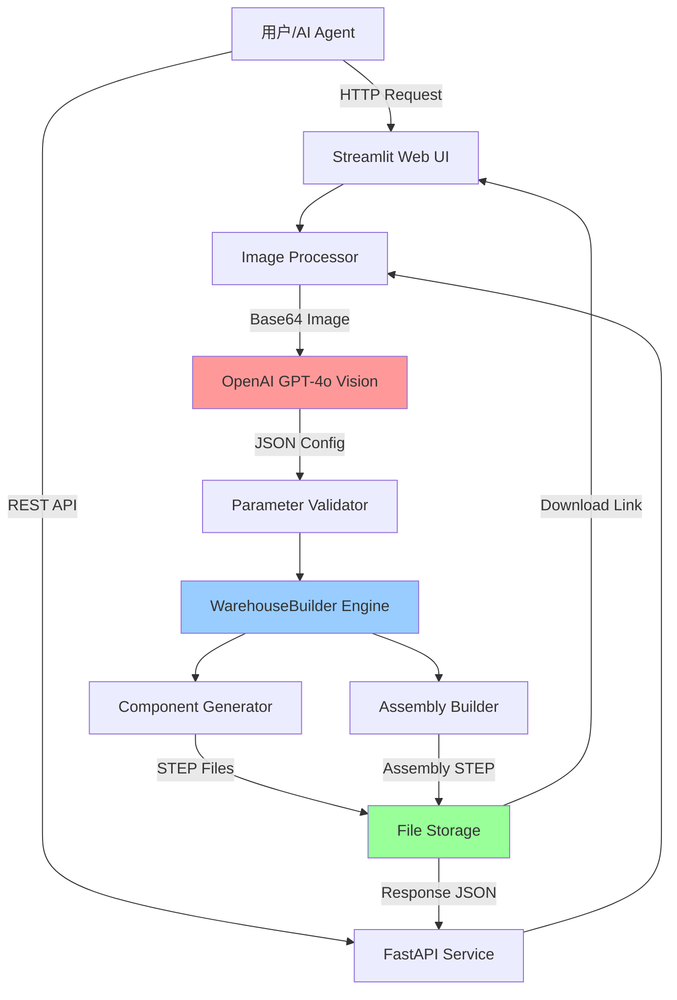

# 技术架构设计文档

## 1. 技术栈清单

### 1.1 核心技术栈

| 层级 | 技术选型 | 版本要求 | 用途 |
|------|---------|---------|------|
| 语言 | Python | ≥3.10 | 主开发语言 |
| CAD引擎 | CadQuery | ≥2.4.0 | 参数化几何建模 |
| AI服务 | OpenAI API | GPT-4o | 多模态视觉分析 |
| Web框架 | Streamlit | ≥1.28.0 | 快速UI原型 |
| 文件格式 | STEP | AP203 | 工业标准输出 |
| 图像处理 | Pillow | ≥10.0.0 | 图片预处理 |
| 配置管理 | python-dotenv | ≥1.0.0 | 环境变量管理 |

### 1.2 可选技术栈（未来扩展）

| 技术 | 用途 | 优先级 |
|------|------|--------|
| FastAPI | RESTful API服务 | P1 |
| PostgreSQL | 任务队列与结果存储 | P2 |
| Redis | 缓存AI分析结果 | P2 |
| Docker | 容器化部署 | P2 |
| FreeCAD | 模型验证与预览 | P3 |

## 2. 系统架构

### 2.1 整体架构图



### 2.2 模块划分

#### 模块1: 图像处理层 (Image Processor)
- **职责**: 图片上传、格式转换、Base64编码
- **输入**: JPG/PNG文件（≤10MB）
- **输出**: Base64字符串 + 元数据（尺寸、格式）
- **性能要求**: 处理时间<1s

#### 模块2: AI分析层 (AI Analyzer)
- **职责**: 调用GPT-4o Vision API，提取结构参数
- **输入**: Base64图片 + 用户Prompt
- **输出**: 标准JSON配置（符合PRD定义）
- **性能要求**: API响应<15s，重试机制（最多3次）
- **错误处理**: 超时/失败时返回默认参数模板

#### 模块3: 参数验证层 (Parameter Validator)
- **职责**: 验证AI输出，补全缺失参数，范围检查
- **输入**: AI返回的JSON
- **输出**: 验证后的完整配置JSON
- **验证规则**:
  - 数值范围检查（bay_width: 1000-4000mm）
  - 必填字段检查（rows, levels, bay_width等）
  - 逻辑一致性（total_height > first_beam_height + levels*beam_spacing）

#### 模块4: 几何引擎层 (WarehouseBuilder)
- **职责**: 参数化生成3D几何模型
- **核心类**: `WarehouseBuilder`, `ComponentFactory`, `AssemblyManager`
- **输入**: 验证后的配置JSON
- **输出**: STEP文件（部件+装配体）
- **性能要求**: 单仓库生成<15s

#### 模块5: 文件存储层 (File Storage)
- **职责**: 管理输出文件、生成下载链接
- **存储结构**: 按时间戳+任务ID组织目录
- **清理策略**: 7天后自动删除临时文件

## 3. 数据流向

### 3.1 主流程数据流

```
[用户上传图片]
    ↓
[Image Processor: 编码为Base64]
    ↓
[AI Analyzer: 调用GPT-4o Vision]
    ↓
[Parameter Validator: 验证+补全]
    ↓
[WarehouseBuilder: 生成部件]
    ↓
[ComponentFactory: 创建upright/beam/decking]
    ↓
[AssemblyManager: 组装部件]
    ↓
[File Storage: 保存STEP文件]
    ↓
[返回下载链接/文件]
```

### 3.2 关键数据结构转换

```
原始图片 (JPG/PNG)
    ↓ encode_image()
Base64字符串 (data:image/jpeg;base64,...)
    ↓ OpenAI API
AI JSON响应 (可能不完整)
    ↓ validate_and_complete()
完整配置JSON (符合Schema)
    ↓ build_from_json()
CadQuery Assembly对象
    ↓ export()
STEP文件 (二进制)
```

## 4. 核心算法设计

### 4.1 部件独立生成算法

```python
# 伪代码
def generate_component(component_type, params):
    """
    生成独立部件并保存
    """
    geometry = create_geometry(component_type, params)
    filename = f"components/{component_type}_{generate_id()}.step"
    geometry.save(filename, exportType="STEP")
    return {
        "file_path": filename,
        "geometry_ref": geometry,  # 内存引用，用于后续装配
        "metadata": extract_metadata(geometry)
    }
```

### 4.2 装配关系管理算法

```python
# 伪代码
def build_assembly(config):
    """
    组装部件，建立位置关系
    """
    components = {}
    assembly = cq.Assembly()
    
    # 1. 生成所有部件（独立文件）
    for component_spec in config["components"]:
        comp = generate_component(component_spec)
        components[comp["id"]] = comp
    
    # 2. 计算位置矩阵
    for row in range(config["rows"]):
        for level in range(config["levels"]):
            # 计算upright位置
            upright_pos = calculate_upright_position(row, level)
            # 计算beam位置（基于upright）
            beam_pos = calculate_beam_position(upright_pos, level)
            # 添加约束关系
            assembly.add(components["upright"], loc=upright_pos)
            assembly.add(components["beam"], loc=beam_pos, 
                        constraints=[constrain_to_upright()])
    
    return assembly
```

### 4.3 参数联动算法

```python
# 伪代码
def update_parameter(config, param_name, new_value):
    """
    参数联动更新
    """
    config[param_name] = new_value
    
    # 联动规则表
    linkage_rules = {
        "bay_width": ["beam.length", "decking.width"],
        "bay_depth": ["beam.count", "decking.depth"],
        "levels": ["beam.count", "decking.count"],
        "total_height": ["upright.height", "beam_spacing"]
    }
    
    # 自动更新关联参数
    if param_name in linkage_rules:
        for linked_param in linkage_rules[param_name]:
            update_linked_parameter(config, linked_param, new_value)
    
    return config
```

## 5. 接口设计

### 5.1 内部模块接口

#### ComponentFactory接口

```python
class ComponentFactory:
    def create_upright(self, height: float, section: str, color: str) -> Tuple[cq.Workplane, cq.Color]:
        """生成立柱部件"""
        pass
    
    def create_beam(self, length: float, section: str, color: str) -> Tuple[cq.Workplane, cq.Color]:
        """生成横梁部件"""
        pass
    
    def create_decking(self, width: float, depth: float, type: str) -> Tuple[cq.Workplane, cq.Color]:
        """生成层板部件"""
        pass
```

#### AssemblyManager接口

```python
class AssemblyManager:
    def add_component(self, component: Component, position: Vector, constraints: List[Constraint]):
        """添加部件到装配体"""
        pass
    
    def export_assembly(self, filename: str) -> str:
        """导出装配体STEP文件"""
        pass
    
    def export_components(self, output_dir: str) -> List[str]:
        """导出所有部件STEP文件"""
        pass
```

### 5.2 外部API接口（见API.md详细定义）

- `POST /api/v1/generate` - 生成仓库模型
- `GET /api/v1/status/{task_id}` - 查询任务状态
- `GET /api/v1/download/{file_id}` - 下载模型文件

## 6. 性能优化策略

### 6.1 AI调用优化
- **缓存机制**: 相同图片Hash值复用分析结果（Redis存储，TTL=24h）
- **批量处理**: 支持多图片批量分析（未来扩展）
- **降级策略**: AI失败时使用规则引擎生成默认参数

### 6.2 几何生成优化
- **延迟计算**: 部件几何在需要时才生成（Lazy Evaluation）
- **并行生成**: 独立部件可并行生成（multiprocessing）
- **增量更新**: 参数修改时只重新生成受影响部件

### 6.3 文件I/O优化
- **异步写入**: 大文件采用异步写入，不阻塞主线程
- **压缩存储**: 输出目录打包为ZIP（可选）
- **CDN加速**: 下载链接使用CDN（生产环境）

## 7. 错误处理策略

### 7.1 错误分类

| 错误类型 | HTTP状态码 | 处理策略 |
|---------|-----------|---------|
| 图片格式错误 | 400 | 返回错误消息，提示支持格式 |
| AI API超时 | 504 | 重试3次，失败后使用默认参数 |
| 参数验证失败 | 422 | 返回详细验证错误列表 |
| 几何生成失败 | 500 | 记录日志，返回通用错误消息 |
| 文件写入失败 | 500 | 检查磁盘空间，重试写入 |

### 7.2 日志策略
- **日志级别**: INFO（正常流程）、WARNING（降级处理）、ERROR（失败）
- **日志格式**: JSON格式，包含timestamp、task_id、error_code
- **存储位置**: `logs/`目录，按日期分割文件

## 8. 安全考虑

### 8.1 输入验证
- 图片大小限制：≤10MB
- 图片格式白名单：JPG、PNG
- API Key验证：OpenAI API Key加密存储

### 8.2 输出安全
- 文件路径验证：防止路径遍历攻击
- 文件名清理：移除特殊字符，防止注入
- 访问控制：下载链接包含临时Token（TTL=1h）

## 9. 部署架构

### 9.1 开发环境
```
Local Machine
├── Python 3.10+
├── Streamlit (localhost:8501)
└── 本地文件存储
```

### 9.2 生产环境（未来）
```
Cloud Server (AWS/GCP)
├── Load Balancer
├── Streamlit App (多实例)
├── FastAPI Service (多实例)
├── Redis (缓存)
├── PostgreSQL (任务队列)
└── S3/OSS (文件存储)
```

## 10. 扩展性设计

### 10.1 水平扩展
- 无状态服务设计，支持多实例部署
- 文件存储使用对象存储（S3/OSS），共享访问

### 10.2 功能扩展点
- **插件化部件库**: 支持自定义部件类型（通过配置文件）
- **多CAD引擎支持**: 未来可支持FreeCAD Python API、OpenSCAD
- **云端渲染**: 集成Three.js/WebGL实现浏览器3D预览

